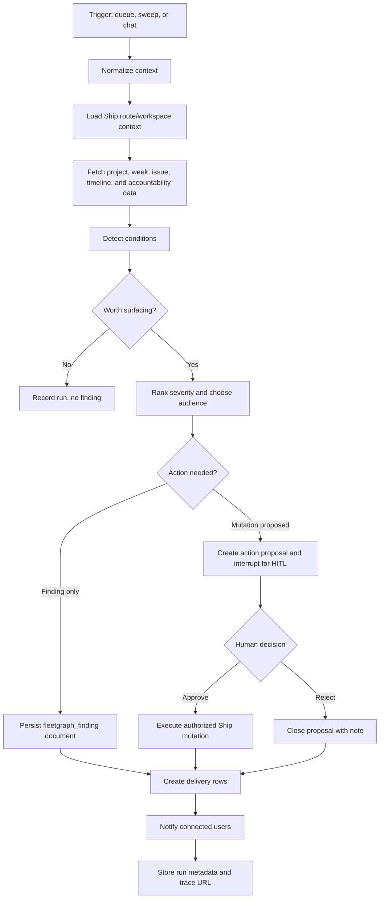

# FleetGraph Design

Last reviewed: 2026-05-25

FleetGraph is Ship's project intelligence agent. It reads real Ship project state, reasons over program, project, week, issue, and accountability signals, and surfaces timely findings inside the existing Ship experience.

This document is the working design contract for the Week 5 build. It is intentionally implementation-facing: if code behavior disagrees with this file, update the file or fix the code before submission.

## Responsibility

### What FleetGraph Monitors Proactively

FleetGraph monitors:

- Week plans, weekly reviews, standups, and approval state.
- Project and program timelines from Ship's existing timeline services.
- Issue state, assignees, stalled work, late work, reopened work, and scope churn.
- RACI-style ownership and accountability fields on programs, projects, and weeks.
- Existing accountability gaps already computed by Ship, with FleetGraph adding durable analysis and notification.

FleetGraph does not replace Ship's accountability system. It turns important inferred conditions into durable findings, traceable recommendations, and human-approved action proposals.

### What FleetGraph Reasons About On Demand

When invoked from the Ship UI, FleetGraph uses the current route context:

- Current path.
- Current document ID and document type.
- Current project ID when available.
- Recent conversation history in the embedded assistant panel.

The on-demand graph answers questions such as:

- "What should I look at next on this project?"
- "Why is this week at risk?"
- "What changed since this plan was approved?"
- "Which issues are blocking the project goal?"
- "Who should be notified and why?"

### What FleetGraph Can Do Autonomously

FleetGraph can autonomously:

- Read Ship state for the workspace it is evaluating.
- Run graph evaluations from queued events or scheduled sweeps.
- Create `fleetgraph_finding` documents.
- Create finding delivery/read-state rows for target users.
- Notify connected users through Ship's realtime event channel after durable rows exist.
- Record run metadata, costs, LangSmith trace URLs, and audit events.

### What Always Requires Human Approval

FleetGraph must ask a human before it:

- Edits any project, program, week, issue, or person document.
- Changes issue state, assignee, priority, dates, or scope.
- Approves, unapproves, rejects, or requests changes on plans or reviews.
- Posts user-authored comments or status updates.
- Changes RACI ownership or accountability fields.

These actions become `fleetgraph_action_proposals`. A signed-in user with the normal Ship authorization for that action must approve or reject the proposal.

### Who FleetGraph Notifies

Notification routing follows Ship ownership:

- Issue risk: assignee first, then project owner/accountable when escalation is needed.
- Week plan/review risk: week owner and accountable approver.
- Project risk: project owner, project accountable, and program accountable.
- Program-level risk: program accountable and workspace admins when configured.
- On-demand response: only the requesting user unless the user explicitly shares or acts.

Delivery state is per user, not embedded only in the finding document, so users can read, dismiss, snooze, or retain the same finding independently.

## Architecture Decisions

### Durable Findings

FleetGraph findings are Ship documents:

- Add `fleetgraph_finding` to the `document_type` enum.
- Store finding narrative in the document body.
- Store operational metadata in `properties`.
- Use existing `program`, `project`, and `sprint` document associations for grouping.
- Store focal target metadata in properties rather than adding a new relationship enum.

Expected properties:

```json
{
  "target_document_id": "...",
  "target_document_type": "issue",
  "detection_type": "stalled_issue",
  "severity": "medium",
  "status": "open",
  "run_id": "...",
  "thread_id": "...",
  "langsmith_trace_url": "https://...",
  "idempotency_key": "...",
  "created_by_actor": "fleetgraph"
}
```

### Trigger Model

FleetGraph uses a hybrid trigger model:

- Ship mutation paths enqueue durable evaluation jobs.
- A scheduled worker or cron drains the queue every 1-2 minutes.
- A scheduled sweep catches missed events, imports, restarts, and stale project state.
- Database locks prevent duplicate work across overlapping workers.
- Idempotency keys prevent duplicate findings for the same condition and state window.

The latency target is less than 5 minutes from Ship event to surfaced finding. The queue cadence leaves room for retries while staying inside the PRD target.

### Graph Persistence

FleetGraph uses LangGraph with the Postgres checkpointer:

- LangGraph checkpoints are the source of truth for paused/resumable graph execution.
- Ship-owned tables store run summaries, action proposals, delivery state, costs, and trace URLs.
- `thread_id` ties the LangGraph checkpoint to a Ship run and, when relevant, to a finding document.

Thread ID examples:

- `fleetgraph:proactive:{workspaceId}:{runId}`
- `fleetgraph:chat:{workspaceId}:{userId}:{documentId}`
- `fleetgraph:approval:{workspaceId}:{proposalId}`

### UI Integration

FleetGraph is embedded in Ship's existing assistant surface:

- Reuse the Ask Ship drawer shell.
- Add a FleetGraph mode or tab instead of a standalone chatbot page.
- Add notification badges for unread FleetGraph findings.
- Add finding detail views that can open the durable finding document.
- Add approve, reject, snooze, and dismiss controls where authorization permits.

Backend endpoints should be separate from Ask Ship:

- `GET /api/fleetgraph/status`
- `POST /api/fleetgraph/chat`
- `GET /api/fleetgraph/findings`
- `GET /api/fleetgraph/findings/:id`
- `POST /api/fleetgraph/findings/:id/read`
- `POST /api/fleetgraph/findings/:id/snooze`
- `GET /api/fleetgraph/runs/:id`
- `POST /api/fleetgraph/actions/:id/approve`
- `POST /api/fleetgraph/actions/:id/reject`

All routes must be registered with OpenAPI following Ship's route/schema pattern.

### Actor Model

FleetGraph has a system actor identity for detection and notification. It does not impersonate humans.

Audit records must distinguish:

- `actorType: "fleetgraph"` for autonomous detection, finding persistence, and notification.
- `approvedByUserId` for any human-approved action proposal.
- `runId`, `threadId`, and `langsmithTraceUrl` for traceability.

## Data Model Sketch

The exact migration names will depend on current Ship migration numbering.

```sql
ALTER TYPE document_type ADD VALUE IF NOT EXISTS 'fleetgraph_finding';

CREATE TABLE fleetgraph_event_queue (
  id UUID PRIMARY KEY DEFAULT gen_random_uuid(),
  workspace_id UUID NOT NULL REFERENCES workspaces(id) ON DELETE CASCADE,
  source_event_type TEXT NOT NULL,
  source_document_id UUID REFERENCES documents(id) ON DELETE SET NULL,
  payload JSONB NOT NULL DEFAULT '{}',
  status TEXT NOT NULL DEFAULT 'queued',
  idempotency_key TEXT NOT NULL,
  available_at TIMESTAMPTZ NOT NULL DEFAULT now(),
  locked_at TIMESTAMPTZ,
  locked_by TEXT,
  attempt_count INTEGER NOT NULL DEFAULT 0,
  last_error TEXT,
  created_at TIMESTAMPTZ NOT NULL DEFAULT now(),
  updated_at TIMESTAMPTZ NOT NULL DEFAULT now(),
  UNIQUE(workspace_id, idempotency_key)
);

CREATE TABLE fleetgraph_runs (
  id UUID PRIMARY KEY DEFAULT gen_random_uuid(),
  workspace_id UUID NOT NULL REFERENCES workspaces(id) ON DELETE CASCADE,
  user_id UUID REFERENCES users(id) ON DELETE SET NULL,
  mode TEXT NOT NULL,
  trigger_type TEXT NOT NULL,
  trigger_id UUID,
  thread_id TEXT NOT NULL,
  status TEXT NOT NULL DEFAULT 'started',
  langsmith_trace_url TEXT,
  model TEXT,
  input_tokens INTEGER,
  output_tokens INTEGER,
  estimated_cost_usd NUMERIC(12, 6),
  metadata JSONB NOT NULL DEFAULT '{}',
  error TEXT,
  created_at TIMESTAMPTZ NOT NULL DEFAULT now(),
  completed_at TIMESTAMPTZ
);

CREATE TABLE fleetgraph_deliveries (
  id UUID PRIMARY KEY DEFAULT gen_random_uuid(),
  workspace_id UUID NOT NULL REFERENCES workspaces(id) ON DELETE CASCADE,
  finding_document_id UUID NOT NULL REFERENCES documents(id) ON DELETE CASCADE,
  user_id UUID NOT NULL REFERENCES users(id) ON DELETE CASCADE,
  status TEXT NOT NULL DEFAULT 'unread',
  delivered_at TIMESTAMPTZ NOT NULL DEFAULT now(),
  read_at TIMESTAMPTZ,
  dismissed_at TIMESTAMPTZ,
  snoozed_until TIMESTAMPTZ,
  UNIQUE(finding_document_id, user_id)
);

CREATE TABLE fleetgraph_action_proposals (
  id UUID PRIMARY KEY DEFAULT gen_random_uuid(),
  workspace_id UUID NOT NULL REFERENCES workspaces(id) ON DELETE CASCADE,
  finding_document_id UUID REFERENCES documents(id) ON DELETE SET NULL,
  run_id UUID REFERENCES fleetgraph_runs(id) ON DELETE SET NULL,
  proposed_action TEXT NOT NULL,
  target_document_id UUID REFERENCES documents(id) ON DELETE SET NULL,
  payload JSONB NOT NULL DEFAULT '{}',
  status TEXT NOT NULL DEFAULT 'pending',
  requested_by_actor TEXT NOT NULL DEFAULT 'fleetgraph',
  decided_by_user_id UUID REFERENCES users(id) ON DELETE SET NULL,
  decided_at TIMESTAMPTZ,
  decision_note TEXT,
  created_at TIMESTAMPTZ NOT NULL DEFAULT now()
);
```

## Graph Map



## Use Cases

| # | Role | Trigger | Detection or Output | Human Approval | Trace |
|---|---|---|---|---|---|
| 1 | PM | Week starts without an approved plan | Finding on the week, notify week owner and approver | Required only if FleetGraph proposes creating/changing plan content | TBD |
| 2 | Director | Project has repeated scope churn or stalled issues | Project risk finding with evidence from issues and timeline | Required before changing project status or assignments | TBD |
| 3 | Engineer | Assigned issue is stale or blocked | Finding explaining blocker, likely next step, and owner | Required before changing issue status/assignee | TBD |
| 4 | PM | Approved plan changes after approval | Finding that re-review is needed with changed document link | Required for any approval/unapproval action | TBD |
| 5 | Director | Program has projects with missing accountable/owner data | Finding listing affected projects and suggested owners to confirm | Required before changing RACI fields | TBD |
| 6 | User | Opens FleetGraph from a project or week | Context-aware chat answer grounded in current view | Required before executing any mutation proposed in chat | TBD |

## Human-in-the-Loop Experience

FleetGraph uses LangGraph interrupts for approval gates. The UI shows:

- Proposed action.
- Evidence and cited Ship records.
- Expected mutation payload.
- LangSmith trace link.
- Approve, reject, snooze, and dismiss controls.

Approve and reject actions go through authenticated `/api/fleetgraph/actions/:id/*` endpoints. Those endpoints must enforce the same authorization rules as the underlying Ship operation.

## Observability

LangSmith tracing is required from day one.

Every completed or failed FleetGraph run should store:

- Ship run ID.
- LangGraph thread ID.
- LangSmith trace URL.
- Trigger type and source document.
- Model name.
- Token usage and estimated cost when provider metadata is available.
- Error details safe for internal inspection.

Shared trace links must be reviewed before submission because public LangSmith trace links can expose sensitive information. Do not put secrets, full session cookies, bearer tokens, or irrelevant personal data in graph state or trace metadata.

## Performance and Cost

Targets:

- Detection latency: less than 5 minutes from Ship event to finding delivery.
- Queue drain cadence: 1-2 minutes.
- Sweep cadence: start at 5 minutes locally or in demo; adjust after measuring load.
- Duplicate finding rate: zero for the same workspace, target, detection type, and state window.
- Cost per run: measured and documented after the first real model run.

Cost assumptions to fill before final submission:

- Proactive runs per project per day.
- On-demand invocations per user per day.
- Average input/output tokens by use case.
- Current provider price for chosen model on submission day.
- Monthly projections at 100, 1,000, and 10,000 users.

## Test Plan

Required implementation tests:

- Migration tests for new enum value, queue table, runs, deliveries, and action proposals.
- Unit tests for trigger idempotency and queue locking.
- Unit tests for each detection node using real Ship-shaped fixtures.
- API tests for FleetGraph routes, auth, authorization, OpenAPI registration, and CSRF behavior.
- Graph tests for interrupt/resume behavior with the Postgres checkpointer.
- E2E test showing a Ship event becomes a UI notification and finding within 5 minutes.
- E2E test showing an on-demand FleetGraph chat uses the current project/week context.
- E2E or integration test for approve/reject action proposal flow.
- Trace validation with at least two shared LangSmith links before submission.

## Ship Reference Points

Reference repo:

`C:\Users\jaynyasg\OneDrive\Documents\GitLab\ship`

Reference commit:

`0a1837f7a16cf14bcbb54164f549a4b8b219e676`

Important files:

- `docs/unified-document-model.md`
- `docs/application-architecture.md`
- `docs/document-model-conventions.md`
- `docs/week-documentation-philosophy.md`
- `api/src/db/schema.sql`
- `api/src/routes/assistant.ts`
- `api/src/services/assistant/*`
- `api/src/collaboration/index.ts`
- `web/src/components/assistant/AskShipPanel.tsx`
- `web/src/hooks/useRealtimeEvents.tsx`
- `web/src/pages/App.tsx`

