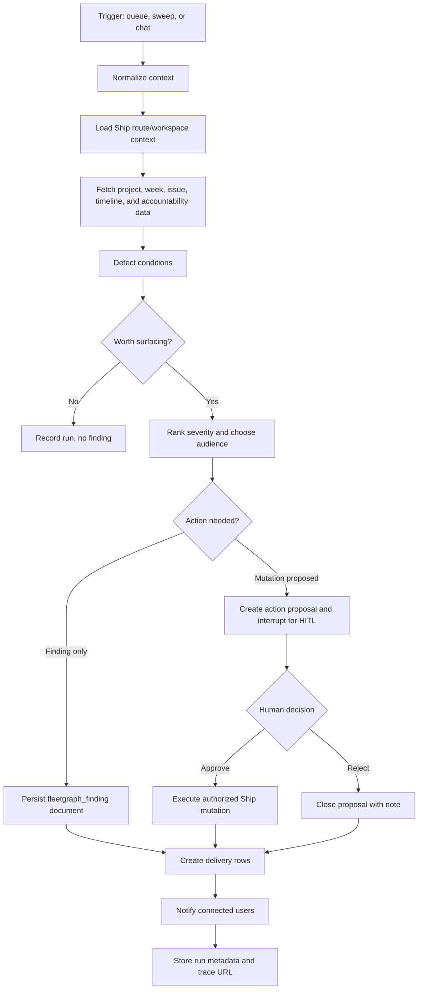

# FleetGraph Design

Last reviewed: 2026-05-26

FleetGraph is Ship's project intelligence agent. It reads real Ship project state, reasons over program, project, week, issue, and accountability signals, and surfaces timely findings inside the existing Ship experience.

This document is the working design contract for the Week 5 build. It is intentionally implementation-facing: if code behavior disagrees with this file, update the file or fix the code before submission.

## Responsibility

### What FleetGraph Monitors Proactively

FleetGraph monitors:

- Week plans, weekly reviews, standups, and approval state.
- Project and program timelines from Ship's existing timeline services.
- Issue state, assignees, stalled work, late work, reopened work, and scope churn.
- RACI-style ownership and accountability fields on programs, projects, and weeks.
- Existing accountability gaps already computed by Ship, with FleetGraph adding durable analysis and notification.

FleetGraph does not replace Ship's accountability system. It turns important inferred conditions into durable findings, traceable recommendations, and human-approved action proposals.

### What FleetGraph Reasons About On Demand

When invoked from the Ship UI, FleetGraph uses the current route context:

- Current path.
- Current document ID and document type.
- Current project ID when available.
- Recent conversation history in the embedded assistant panel.

The on-demand graph answers questions such as:

- "What should I look at next on this project?"
- "Why is this week at risk?"
- "What changed since this plan was approved?"
- "Which issues are blocking the project goal?"
- "Who should be notified and why?"

### What FleetGraph Can Do Autonomously

FleetGraph can autonomously:

- Read Ship state for the workspace it is evaluating.
- Run graph evaluations from queued events or scheduled sweeps.
- Create `fleetgraph_finding` documents.
- Create finding delivery/read-state rows for target users.
- Notify connected users through Ship's realtime event channel after durable rows exist.
- Record run metadata, costs, LangSmith trace URLs, and audit events.

### What Always Requires Human Approval

FleetGraph must ask a human before it:

- Edits any project, program, week, issue, or person document.
- Changes issue state, assignee, priority, dates, or scope.
- Approves, unapproves, rejects, or requests changes on plans or reviews.
- Posts user-authored comments or status updates.
- Changes RACI ownership or accountability fields.

These actions become `fleetgraph_action_proposals`. A signed-in user with the normal Ship authorization for that action must approve or reject the proposal.

### Who FleetGraph Notifies

Notification routing follows Ship ownership:

- Issue risk: assignee first, then project owner/accountable when escalation is needed.
- Week plan/review risk: week owner and accountable approver.
- Project risk: project owner, project accountable, and program accountable.
- Program-level risk: program accountable and workspace admins when configured.
- On-demand response: only the requesting user unless the user explicitly shares or acts.

Delivery state is per user, not embedded only in the finding document, so users can read, dismiss, snooze, or retain the same finding independently.

## Architecture Decisions

### Durable Findings

FleetGraph findings are Ship documents:

- Add `fleetgraph_finding` to the `document_type` enum.
- Store finding narrative in the document body.
- Store operational metadata in `properties`.
- Use existing `program`, `project`, and `sprint` document associations for grouping.
- Store focal target metadata in properties rather than adding a new relationship enum.

Expected properties:

```json
{
  "target_document_id": "...",
  "target_document_type": "issue",
  "detection_type": "stalled_issue",
  "severity": "medium",
  "status": "open",
  "run_id": "...",
  "thread_id": "...",
  "langsmith_trace_url": "https://...",
  "idempotency_key": "...",
  "created_by_actor": "fleetgraph"
}
```

### Trigger Model

FleetGraph uses a hybrid trigger model:

- Ship mutation paths enqueue durable evaluation jobs.
- A scheduled worker or cron drains the queue every 1-2 minutes.
- The drain command can enqueue a bounded scheduled sweep before claiming jobs, catching missed events, imports, restarts, and stale project state.
- Database locks prevent duplicate work across overlapping workers.
- Idempotency keys prevent duplicate findings for the same condition and state window.

The latency target is less than 5 minutes from Ship event to surfaced finding. The queue cadence leaves room for retries while staying inside the PRD target.

### Graph Persistence

FleetGraph uses LangGraph with the Postgres checkpointer:

- LangGraph checkpoints are the source of truth for paused/resumable graph execution.
- Ship-owned tables store run summaries, action proposals, delivery state, costs, and trace URLs.
- `thread_id` ties the LangGraph checkpoint to a Ship run and, when relevant, to a finding document.

Thread ID examples:

- `fleetgraph:proactive:{workspaceId}:{runId}`
- `fleetgraph:chat:{workspaceId}:{userId}:{documentId}`
- `fleetgraph:approval:{workspaceId}:{proposalId}`

### UI Integration

FleetGraph is embedded in Ship's existing assistant surface:

- Reuse the Ask Ship drawer shell.
- Add a FleetGraph mode or tab instead of a standalone chatbot page.
- Add notification badges for unread FleetGraph findings.
- Add finding detail views that can open the durable finding document.
- Add approve, reject, snooze, and dismiss controls where authorization permits.

Backend endpoints should be separate from Ask Ship:

- `GET /api/fleetgraph/status`
- `POST /api/fleetgraph/chat`
- `GET /api/fleetgraph/findings`
- `GET /api/fleetgraph/findings/:id`
- `PATCH /api/fleetgraph/deliveries/:id`
- `GET /api/fleetgraph/runs/:id`
- `POST /api/fleetgraph/actions/:id/decision`

Delivery updates accept `read`, `dismissed`, or `snoozed` status. Snoozed deliveries require `snoozedUntil`. Action decisions accept `approved` or `rejected` status plus an optional note.

All routes must be registered with OpenAPI following Ship's route/schema pattern.

### Focused UI Design Review

Review mode: focused text-only design review. The gstack visual designer was not available in this environment, so no mockups were generated.

Initial design completeness: 4/10.

Post-review design completeness: 8/10.

The plan now specifies the high-risk UI surfaces that would otherwise be left to implementation guesswork: the FleetGraph drawer hierarchy, finding states, notification behavior, action proposal gates, and mobile/accessibility constraints.

#### What Already Exists To Reuse

FleetGraph must reuse Ship's existing app UI vocabulary rather than inventing a new AI product surface:

- Right-side assistant drawer shell from `web/src/components/assistant/AskShipPanel.tsx`.
- Assistant transcript and composer components from `web/src/components/assistant/*`.
- Tab pattern from `web/src/components/ui/TabBar.tsx`.
- Existing realtime events provider from `web/src/hooks/useRealtimeEvents.tsx`.
- Existing toast provider from `web/src/components/ui/Toast.tsx`.
- Existing rail button pattern from `web/src/pages/App.tsx`.
- Ship's dark, dense, task-focused workspace style: muted text, thin borders, compact rows, restrained accent color.

Do not introduce a hero layout, marketing copy, decorative cards, or a separate chatbot page.

#### Drawer Information Architecture

FleetGraph lives inside the existing right-side assistant drawer. The drawer has three persistent zones:

```text
+--------------------------------------------------+
| Header                                           |
| Ask Ship | FleetGraph        status / close      |
+--------------------------------------------------+
| FleetGraph body                                  |
|                                                  |
| Findings inbox OR selected finding detail        |
|                                                  |
| - risk summary                                   |
| - evidence links                                 |
| - trace / run metadata                           |
| - action proposal gate, when present             |
|                                                  |
+--------------------------------------------------+
| Composer / contextual prompt shortcuts           |
+--------------------------------------------------+
```

Default behavior:

- If FleetGraph opens from a notification, show the selected finding detail first.
- If FleetGraph opens from a project, week, issue, or program route, show findings filtered to that current context first.
- If no finding is selected, show a compact findings inbox above the composer.
- If the user switches back to Ask Ship, preserve the FleetGraph unread count and selected finding state.

Primary hierarchy inside FleetGraph detail:

1. Severity and plain-language risk summary.
2. Target document and current Ship context.
3. Evidence, including cited Ship records and timeline signals.
4. Recommended next step.
5. Action proposal controls, if an action requires approval.
6. Trace/run metadata collapsed by default.

Only one finding detail is open at a time. Avoid nested cards inside the drawer. Use compact sections separated by borders and headings.

#### Finding Inbox Row

Each finding row should be scannable in under three seconds:

- Severity marker: critical, high, medium, low.
- Short title, maximum two lines.
- Target label: project, week, issue, or program.
- Age or detection time.
- Status: unread, read, snoozed, dismissed, action pending, action approved, action rejected.
- Optional trace/run icon only when useful for debugging.

Rows are buttons with clear focus states. Hover-only controls are allowed for secondary actions on desktop, but the same controls must be visible or reachable on keyboard and touch.

#### Notification Rules

FleetGraph notifications should build trust, not become noise:

- Rail badge shows unread FleetGraph deliveries.
- Drawer badge shows unread count next to the FleetGraph tab.
- Toasts appear only for new high or critical findings, or when an action proposal needs the current user's approval.
- Low and medium findings increment the badge but do not interrupt the user with a toast.
- Toast action opens the drawer directly to the finding detail.
- Dismissed and snoozed findings leave the shared finding document intact and update only that user's delivery row.

Realtime events should use a dedicated event type such as `fleetgraph:finding-delivered`. The event payload should be small: finding ID, delivery ID, severity, title, target label, and whether action is required.

#### Interaction States

| Feature | Loading | Empty | Error | Success | Partial |
|---|---|---|---|---|---|
| FleetGraph status | Header says "Checking FleetGraph" and disables composer | Not applicable | Header says "FleetGraph unavailable" with retry | Header says "Ready" | Header says "Limited" when tracing or model config is missing |
| Findings inbox | Skeleton rows matching compact row height | "No FleetGraph findings for this context" plus a "Ask about this view" action | Inline error with retry | Sorted finding rows with unread first | Shows available rows plus "Some findings could not load" |
| Finding detail | Detail skeleton with title, evidence, and action placeholders | "Select a finding" when no row is active | Inline error with back-to-list action | Detail, evidence, metadata, and controls | Missing trace or evidence section is labeled without hiding the finding |
| Chat response | Composer disabled and transcript shows "Thinking..." | First-run prompt shortcuts tied to current route | Assistant message explains failure and preserves typed prompt | Response cites Ship records and can link to findings | Response warns when only partial context was available |
| Action proposal | Buttons disabled and show "Submitting..." | No action block appears | Error stays inside the action block with retry | Proposal status updates in place | Unauthorized users see read-only proposal and owner to contact |
| Notifications | Badge count updates after durable delivery | Badge hidden at zero | Toast says notification failed only for current user action failures | Toast opens exact finding | Badge can update before inbox refresh, then reconciles on fetch |

Empty states should be calm and useful. Do not ship "No items found." as the full state.

#### Human Approval Gate UI

Action proposals appear in the selected finding detail as a compact approval block:

- Proposed action title.
- Target document link.
- Before/after summary or mutation payload summary.
- Evidence list supporting the recommendation.
- Authorization note: who can approve this.
- LangSmith trace link, collapsed under "Run details".
- Primary action: Approve.
- Secondary action: Reject.
- Tertiary actions: Snooze and Dismiss.

Approve and reject controls must:

- Require an authenticated user.
- Disable while submitting.
- Preserve the finding detail after completion.
- Show the resulting status inline.
- Never silently execute if the user's authorization no longer permits the underlying Ship mutation.

Reject should allow an optional note. Approve may allow an optional note only if the underlying Ship workflow already supports one.

#### Mobile and Responsive Behavior

The drawer keeps Ship's desktop behavior but becomes a full-screen panel below 640px:

- Width: `max-w-[420px]` on desktop, full viewport width on mobile.
- Header remains sticky.
- Composer remains pinned at the bottom.
- Finding inbox and detail use a single-column drill-in pattern on mobile.
- Touch targets are at least 44px high for row actions and approval controls.
- Toasts should not cover the composer on mobile.

Do not use a hamburger or separate mobile FleetGraph page for MVP.

#### Accessibility Requirements

FleetGraph must support:

- `role="dialog"` on the drawer, preserving the existing non-modal behavior unless the app changes it globally.
- Distinct accessible labels for Ask Ship and FleetGraph tabs.
- Keyboard navigation through tabs, finding rows, action controls, and composer.
- Visible focus rings on rows and buttons.
- `aria-live="polite"` for badge/toast changes that do not require immediate interruption.
- `aria-live="assertive"` only for critical action-required failures.
- Color contrast at WCAG AA for all text and status labels.
- Status icons paired with text, not color alone.

#### Not In Scope For MVP

- A standalone FleetGraph page.
- A new global notification center.
- Decorative AI visual branding.
- Multi-finding split panes inside the drawer.
- User-configurable notification rules.
- Bulk approve/reject flows.

### Actor Model

FleetGraph has a system actor identity for detection and notification. It does not impersonate humans.

Audit records must distinguish:

- `actorType: "fleetgraph"` for autonomous detection, finding persistence, and notification.
- `approvedByUserId` for any human-approved action proposal.
- `runId`, `threadId`, and `langsmithTraceUrl` for traceability.

The runtime runner invokes FleetGraph through a compiled LangGraph `StateGraph` with the Postgres checkpointer and stable `thread_id` values. The deterministic state runner remains for local eval coverage, and the no-database FleetGraph eval suite uses LangGraph `MemorySaver` to verify interrupt/resume behavior without requiring local PostgreSQL.

## Data Model Sketch

The exact migration names will depend on current Ship migration numbering.

```sql
ALTER TYPE document_type ADD VALUE IF NOT EXISTS 'fleetgraph_finding';

CREATE TABLE fleetgraph_event_queue (
  id UUID PRIMARY KEY DEFAULT gen_random_uuid(),
  workspace_id UUID NOT NULL REFERENCES workspaces(id) ON DELETE CASCADE,
  source_event_type TEXT NOT NULL,
  source_document_id UUID REFERENCES documents(id) ON DELETE SET NULL,
  payload JSONB NOT NULL DEFAULT '{}',
  status TEXT NOT NULL DEFAULT 'queued',
  idempotency_key TEXT NOT NULL,
  available_at TIMESTAMPTZ NOT NULL DEFAULT now(),
  locked_at TIMESTAMPTZ,
  locked_by TEXT,
  attempt_count INTEGER NOT NULL DEFAULT 0,
  last_error TEXT,
  created_at TIMESTAMPTZ NOT NULL DEFAULT now(),
  updated_at TIMESTAMPTZ NOT NULL DEFAULT now(),
  UNIQUE(workspace_id, idempotency_key)
);

CREATE TABLE fleetgraph_runs (
  id UUID PRIMARY KEY DEFAULT gen_random_uuid(),
  workspace_id UUID NOT NULL REFERENCES workspaces(id) ON DELETE CASCADE,
  user_id UUID REFERENCES users(id) ON DELETE SET NULL,
  mode TEXT NOT NULL,
  trigger_type TEXT NOT NULL,
  trigger_id UUID,
  thread_id TEXT NOT NULL,
  status TEXT NOT NULL DEFAULT 'started',
  langsmith_trace_url TEXT,
  model TEXT,
  input_tokens INTEGER,
  output_tokens INTEGER,
  estimated_cost_usd NUMERIC(12, 6),
  metadata JSONB NOT NULL DEFAULT '{}',
  error TEXT,
  created_at TIMESTAMPTZ NOT NULL DEFAULT now(),
  completed_at TIMESTAMPTZ
);

CREATE TABLE fleetgraph_deliveries (
  id UUID PRIMARY KEY DEFAULT gen_random_uuid(),
  workspace_id UUID NOT NULL REFERENCES workspaces(id) ON DELETE CASCADE,
  finding_document_id UUID NOT NULL REFERENCES documents(id) ON DELETE CASCADE,
  user_id UUID NOT NULL REFERENCES users(id) ON DELETE CASCADE,
  status TEXT NOT NULL DEFAULT 'unread',
  delivered_at TIMESTAMPTZ NOT NULL DEFAULT now(),
  read_at TIMESTAMPTZ,
  dismissed_at TIMESTAMPTZ,
  snoozed_until TIMESTAMPTZ,
  UNIQUE(finding_document_id, user_id)
);

CREATE TABLE fleetgraph_action_proposals (
  id UUID PRIMARY KEY DEFAULT gen_random_uuid(),
  workspace_id UUID NOT NULL REFERENCES workspaces(id) ON DELETE CASCADE,
  finding_document_id UUID REFERENCES documents(id) ON DELETE SET NULL,
  run_id UUID REFERENCES fleetgraph_runs(id) ON DELETE SET NULL,
  proposed_action TEXT NOT NULL,
  target_document_id UUID REFERENCES documents(id) ON DELETE SET NULL,
  payload JSONB NOT NULL DEFAULT '{}',
  status TEXT NOT NULL DEFAULT 'pending',
  requested_by_actor TEXT NOT NULL DEFAULT 'fleetgraph',
  decided_by_user_id UUID REFERENCES users(id) ON DELETE SET NULL,
  decided_at TIMESTAMPTZ,
  decision_note TEXT,
  created_at TIMESTAMPTZ NOT NULL DEFAULT now()
);
```

## Graph Map



## Use Cases

| # | Role | Trigger | Detection or Output | Human Approval | Trace |
|---|---|---|---|---|---|
| 1 | PM | Week starts without an approved plan | Finding on the week, notify week owner and approver | Required only if FleetGraph proposes creating/changing plan content | LangSmith TBD; deterministic DB/E2E evidence passed 2026-05-26 |
| 2 | Director | Project has repeated scope churn or stalled issues | Project risk finding with evidence from issues and timeline | Required before changing project status or assignments | LangSmith TBD; deterministic eval evidence passed 2026-05-25 |
| 3 | Engineer | Assigned issue is stale or blocked | Finding explaining blocker, likely next step, and owner | Required before changing issue status/assignee | LangSmith TBD; deterministic eval evidence passed 2026-05-25 |
| 4 | PM | Approved plan changes after approval | Finding that re-review is needed with changed document link | Required for any approval/unapproval action | LangSmith TBD; HITL API/UI evidence passed 2026-05-26 |
| 5 | Director | Program has projects with missing accountable/owner data | Finding listing affected projects and suggested owners to confirm | Required before changing RACI fields | LangSmith TBD; deterministic eval evidence passed 2026-05-25 |
| 6 | User | Opens FleetGraph from a project or week | Context-aware chat answer grounded in current view | Required before executing any mutation proposed in chat | LangSmith TBD; deterministic chat/E2E evidence passed 2026-05-26 |

## Human-in-the-Loop Experience

FleetGraph uses LangGraph interrupts for approval gates. The UI shows:

- Proposed action.
- Evidence and cited Ship records.
- Expected mutation payload.
- LangSmith trace link.
- Approve, reject, snooze, and dismiss controls.

Approve and reject actions go through authenticated `POST /api/fleetgraph/actions/:id/decision`. The endpoint must enforce the same authorization rules as the underlying Ship operation before any real mutation is executed.

## Observability

LangSmith tracing is required from day one.

Every completed or failed FleetGraph run should store:

- Ship run ID.
- LangGraph thread ID.
- LangSmith trace URL.
- Trigger type and source document.
- Model name.
- Token usage and estimated cost when provider metadata is available.
- Error details safe for internal inspection.

Shared trace links must be reviewed before submission because public LangSmith trace links can expose sensitive information. Do not put secrets, full session cookies, bearer tokens, or irrelevant personal data in graph state or trace metadata.

## Performance and Cost

Targets:

- Detection latency: less than 5 minutes from Ship event to finding delivery.
- Queue drain cadence: 1-2 minutes.
- Sweep cadence: start at 5 minutes locally or in demo; adjust after measuring load.
- Duplicate finding rate: zero for the same workspace, target, detection type, and state window.
- Cost per run: measured and documented after the first real model run.

Cost assumptions to fill before final submission:

- Proactive runs per project per day.
- On-demand invocations per user per day.
- Average input/output tokens by use case.
- Current provider price for chosen model on submission day.
- Monthly projections at 100, 1,000, and 10,000 users.

Starter cost baseline checked on 2026-05-26:

- Model: `gpt-4o-mini` for low-cost FleetGraph demo runs.
- Price source: [OpenAI GPT-4o mini model pricing](https://platform.openai.com/docs/models/gpt-4o-mini).
- Standard text price used for estimates: $0.15 / 1M input tokens and $0.60 / 1M output tokens.
- E2E seed run example: 1,200 input tokens + 280 output tokens = $0.000348.

Measured validation run rows:

| Date | Source | Mode | Provider/model | Input tokens | Output tokens | Cost basis | Cost |
|---|---|---|---|---:|---:|---|---:|
| 2026-05-26 | E2E seed `fleetgraph_runs` row | proactive | `mock` / `mock-fleetgraph` | 1,200 | 280 | Stored seed estimate at current `gpt-4o-mini` text pricing | $0.000348 |
| 2026-05-26 | Isolated Docker Postgres `fleetgraph_runs` row | chat | `mock` / `mock-fleetgraph` | 787 | 149 | Recomputed `gpt-4o-mini` equivalent from actual run tokens | $0.000207 |
| 2026-05-26 | Isolated Docker Postgres `fleetgraph_runs` row | chat | `mock` / `mock-fleetgraph` | 0 | 0 | No provider usage captured for this validation row | $0.000000 |

These rows prove run usage capture and cost math paths. Actual billable spend and shared LangSmith trace URLs still require model-backed runs with `OPENAI_API_KEY`, `LANGSMITH_API_KEY`, and `LANGSMITH_PROJECT` configured.

Starter projection to replace with real `fleetgraph_runs` measurements:

| Scale | Monthly estimate | Assumptions |
|---|---:|---|
| 100 users | $52.92 | 1 project/user, 12 proactive runs/project/day, 3 on-demand runs/user/day, 5k/500 proactive tokens, 8k/800 on-demand tokens |
| 1,000 users | $529.20 | Same starter assumptions |
| 10,000 users | $5,292.00 | Same starter assumptions |

## Test Plan

Required implementation tests:

- Migration tests for new enum value, queue table, runs, deliveries, and action proposals.
- Unit tests for trigger idempotency and queue locking.
- Unit tests for each detection node using real Ship-shaped fixtures.
- API tests for FleetGraph routes, auth, authorization, OpenAPI registration, and CSRF behavior.
- Graph tests for interrupt/resume behavior with the Postgres checkpointer.
- E2E test showing a Ship event becomes a UI notification and finding within 5 minutes.
- E2E test showing an on-demand FleetGraph chat uses the current project/week context.
- E2E or integration test for approve/reject action proposal flow.
- UI tests for empty, loading, error, unavailable, missing evidence, snoozed, dismissed, rejected action, action-error, and trace-present/missing states.
- Accessibility checks for keyboard navigation, focus order, live regions, and contrast in the FleetGraph drawer; component-level live-region and row-label coverage is in place.
- Mobile checks for full-screen drawer behavior, touch targets, and composer/toast overlap; component-level responsive contract coverage is in place.
- Trace validation with at least two shared LangSmith links before submission.

### Current Implementation Validation

Last checked: 2026-05-26.

Passing local checks:

- `pnpm type-check`
- `pnpm build:api`
- `pnpm build:web`
- `pnpm --filter @ship/api test:fleetgraph-api`
- `pnpm --filter @ship/api exec vitest run src/openapi/fleetgraph.test.ts src/routes/fleetgraph.test.ts`
- `pnpm --filter @ship/api test:fleetgraph-eval`
- `pnpm test:e2e -- e2e/fleetgraph.spec.ts --workers=1`
- focused FleetGraph web hook, drawer, responsive panel, toast, and route-context tests
- `git diff --check`
- pre-commit empty-test check

Current deterministic evidence:

- `e2e/fixtures/isolated-env.ts` seeds a completed proactive FleetGraph run, a delivered unread finding, and a pending human action proposal.
- `e2e/fleetgraph.spec.ts` opens FleetGraph from a Ship document, marks the delivered finding read, rejects the action proposal with a note, and verifies contextual chat response grounding.
- `e2e/fleetgraph.spec.ts` also creates a real sprint document event, drains the FleetGraph queue against the isolated test database, verifies a delivered planning-gap finding appears in the drawer within the 5 minute latency target, and confirms the linked `fleetgraph_runs` row records token/cost metadata.
- `api/src/routes/fleetgraph.test.ts` covers authentication, CSRF, per-user delivery visibility, route-context finding filters, admin run/finding access, action-decision authorization, and audit logging with run/trace metadata.
- `web/src/hooks/useFleetGraph.test.tsx` verifies the current Ship route context is used for both findings fetches and on-demand chat requests.
- `web/src/components/assistant/fleetgraph/FleetGraphPanel.test.tsx` covers delivered findings, loading/empty/error/unavailable states, missing evidence, snooze/dismiss actions, rejected action decisions, action errors, and trace-present/missing run metadata.
- `web/src/components/assistant/fleetgraph/FleetGraphPanel.test.tsx` also verifies announced status/alert regions and accessible finding row labels for unread severity state.
- `web/src/components/assistant/AskShipPanel.test.tsx`, `web/src/components/assistant/fleetgraph/FleetGraphPanel.test.tsx`, and `web/src/components/ui/Toast.test.tsx` verify the FleetGraph drawer's mobile full-width class contract, 44px mobile action targets, and mobile toast offset above the pinned composer.
- `api/src/services/fleetgraph/graph.test.ts`, included in `pnpm --filter @ship/api test:fleetgraph-eval`, verifies the compiled LangGraph workflow can checkpoint an approval interrupt with `MemorySaver` and resume with a human decision.
- `api/src/scripts/fleetgraph-drain.test.ts`, included in `pnpm --filter @ship/api test:fleetgraph-eval`, verifies the scheduled drain command keeps local drain-only defaults and parses Render sweep settings for proactive backstop coverage.
- `api/src/services/fleetgraph/eval-harness.test.ts` scores all six PRD use cases plus the no-finding branch: week planning gap, project churn/stalled issues, stale engineer issue, approved-plan-change HITL, missing ownership, context chat, and no-finding.
- DB-backed validation completed against isolated Docker Postgres on 2026-05-26: `pnpm --filter @ship/api test:fleetgraph-api` passed 22 tests, and the focused FleetGraph OpenAPI/route run passed 17 tests.
- FleetGraph E2E completed on 2026-05-26 with `pnpm test:e2e -- e2e/fleetgraph.spec.ts --workers=1`: 2 passed, including the timed event-to-finding path under the 5 minute requirement.

External evidence still blocked in this environment:

- Model-backed LangSmith traces need `OPENAI_API_KEY`, `LANGSMITH_API_KEY`, and `LANGSMITH_PROJECT`; none were present in the local process on 2026-05-26.
- Public deployment verification needs Render credentials or a known deployed URL; no `RENDER_API_KEY` or FleetGraph public URL was present in the local process on 2026-05-26.
- Actual billable cost rows should be regenerated from deployed or locally configured model-backed `fleetgraph_runs` rows once the provider and tracing credentials are available.

## Implementation Tasks

Synthesized from the focused design review. Each task derives from a specific finding above.

- [ ] **T1 (P1, human: ~2h / CC: ~20min)** - FleetGraph drawer - Implement the three-zone drawer hierarchy.
  - Surfaced by: Focused UI Design Review - the original plan named a drawer but did not define what users see first, second, or third.
  - Files: `web/src/components/assistant/AskShipPanel.tsx`, new FleetGraph drawer components.
  - Verify: Open from global rail, current project/week context, and notification deep link.
- [ ] **T2 (P1, human: ~2h / CC: ~25min)** - Findings UI - Build inbox rows and finding detail states.
  - Surfaced by: Interaction state coverage - finding loading, empty, error, success, and partial states were previously unspecified.
  - Files: new FleetGraph findings components and tests.
  - Verify: Component tests or Storybook-style fixtures for every state in the interaction table.
- [ ] **T3 (P1, human: ~2h / CC: ~25min)** - Action proposals - Build the human approval gate UI.
  - Surfaced by: HITL design - approve/reject/snooze/dismiss controls needed concrete user-visible rules.
  - Files: FleetGraph action proposal component, API hooks, route tests.
  - Verify: Approve, reject, unauthorized, submitting, and failed-submit flows.
- [ ] **T4 (P2, human: ~1h / CC: ~15min)** - Notifications - Add badge and toast rules for delivered findings.
  - Surfaced by: Notification rules - interrupt behavior needed severity-based limits to avoid noisy AI alerts.
  - Files: realtime event type, rail button, toast integration.
  - Verify: Critical findings open a toast; medium/low findings update badge only.
- [ ] **T5 (P2, human: ~1h / CC: ~15min)** - Responsive and accessibility - Add mobile and keyboard/screen reader checks.
  - Surfaced by: Mobile and accessibility requirements - drawer behavior and live regions were not defined.
  - Files: FleetGraph drawer/components, focused UI tests or E2E checks.
  - Verify: 375px viewport, keyboard-only path, focus order, and live-region behavior.

## Ship Reference Points

Reference repo:

`C:\Users\jaynyasg\OneDrive\Documents\GitLab\ship`

Reference commit:

`0a1837f7a16cf14bcbb54164f549a4b8b219e676`

Important files:

- `docs/unified-document-model.md`
- `docs/application-architecture.md`
- `docs/document-model-conventions.md`
- `docs/week-documentation-philosophy.md`
- `api/src/db/schema.sql`
- `api/src/routes/assistant.ts`
- `api/src/services/assistant/*`
- `api/src/collaboration/index.ts`
- `web/src/components/assistant/AskShipPanel.tsx`
- `web/src/hooks/useRealtimeEvents.tsx`
- `web/src/pages/App.tsx`

## GSTACK REVIEW REPORT

| Review | Trigger | Why | Runs | Status | Findings |
|--------|---------|-----|------|--------|----------|
| CEO Review | `/plan-ceo-review` | Scope and strategy | 0 | Not run | Not requested |
| Codex Review | `/codex review` | Independent second opinion | 0 | Not run | Not requested |
| Eng Review | `/plan-eng-review` | Architecture and tests | 1 | Clear | Durable findings, hybrid trigger model, graph persistence, UI integration, actor model, document relationships |
| Design Review | `/plan-design-review` | UI and UX gaps | 1 | Focused pass | Score: 4/10 to 8/10, 5 implementation tasks added |
| DX Review | `/plan-devex-review` | Developer experience gaps | 0 | Not run | Not requested |

- **UNRESOLVED:** visual mockups were not generated because the gstack designer binary is not available in this environment.
- **VERDICT:** ENG CLEARED + DESIGN FOCUSED PASS COMPLETE - ready to implement with the UI tasks above.
