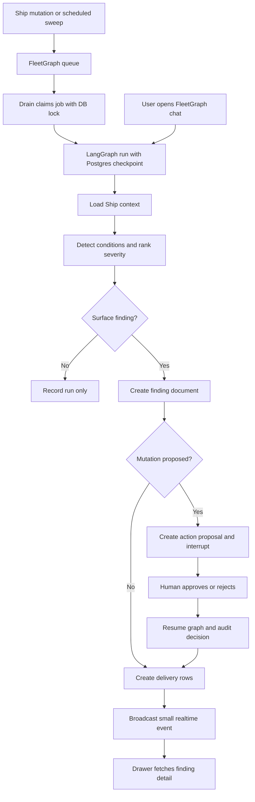
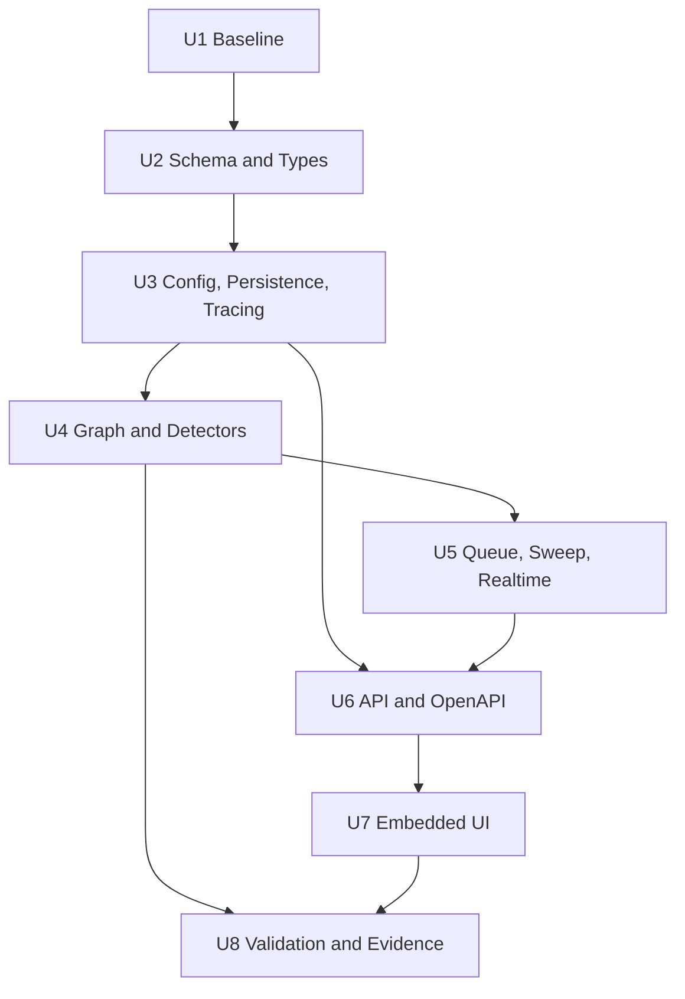
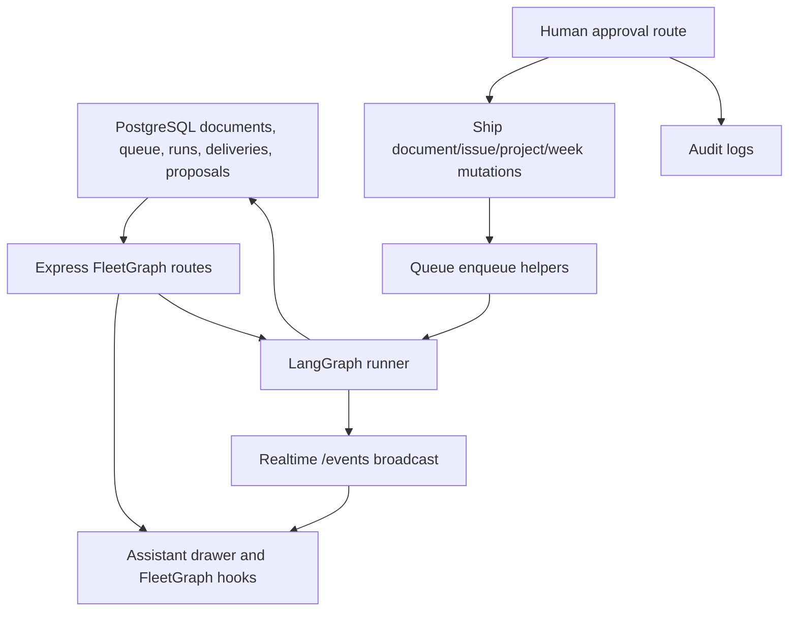

# feat: Add FleetGraph project intelligence agent

**Target repo:** Ship application source tree. Code paths in this plan are repo-relative to the Ship app source. Week5 planning files remain the planning source of truth.

## Summary

Add FleetGraph as a Ship-native graph agent: durable findings are stored as Ship documents, proactive evaluation runs through a durable queue and sweep, human-approved mutations use action proposals, and the UI extends the existing Ask Ship drawer with FleetGraph findings, notifications, and context-aware chat.

---

## Problem Frame

The Week 5 PRD asks for a project intelligence agent that notices project drift before a user asks, reasons over real Ship state, and improves the existing Ship workflow rather than becoming a separate chatbot. Existing Ship surfaces expose documents, issues, weeks, projects, accountability items, and Ask Ship context, but they do not persist proactive agent findings, route those findings to responsible users, or provide a graph-backed human approval loop.

---

## Requirements

- R1. Run against real Ship data for proactive and on-demand modes, with no mocked final responses.
- R2. Surface at least one proactive detection end to end within the PRD latency target.
- R3. Implement context-aware on-demand chat embedded in the existing Ship experience.
- R4. Persist FleetGraph findings as `fleetgraph_finding` documents with evidence, trace metadata, and target metadata.
- R5. Keep per-user delivery/read/dismiss/snooze state separate from the shared finding document.
- R6. Require human approval before FleetGraph mutates issues, weeks, projects, programs, approvals, comments, or RACI/accountability fields.
- R7. Use LangGraph persistence and interrupts for resumable human-in-the-loop graph execution.
- R8. Store Ship-owned run, cost, trace, and action proposal metadata outside raw LangGraph checkpoints.
- R9. Register every FleetGraph API route with OpenAPI and preserve Ship auth, CSRF, and workspace visibility behavior.
- R10. Reuse the Ask Ship drawer shell; do not add a standalone chatbot page or separate FleetGraph destination.
- R11. Add accessible notification, drawer, finding, action proposal, keyboard, and mobile behavior.
- R12. Produce final submission evidence: documented trigger model, graph map, use cases, tests, timed latency run, LangSmith traces, and cost projections.

---

## Scope Boundaries

- FleetGraph MVP may create findings, delivery rows, run metadata, trace links, notifications, and action proposals autonomously.
- FleetGraph MVP must not directly edit project, program, week, issue, approval, RACI, or user-authored comment state without an authenticated human approval route.
- FleetGraph remains inside the existing assistant drawer and rail affordance.
- FleetGraph uses existing Ship workspace-level authorization and does not introduce per-document permissions.
- FleetGraph does not replace Ask Ship retrieval or the existing accountability system; it layers durable graph findings and approvals on top.
- FleetGraph does not introduce a global notification center, bulk approval flow, configurable notification rules, or custom decorative AI branding in MVP.
- FleetGraph does not make LangSmith shared links public until traces have been reviewed for secrets and irrelevant personal data.

### Deferred to Follow-Up Work

- Configurable detection rules and notification preferences: future iteration after the MVP proves signal quality.
- Full checkpoint retention policy and cleanup automation: follow-up after final demo data retention needs are known.
- Indexing FleetGraph findings into Ask Ship retrieval: defer unless implementation shows it is needed for the Week 5 demo.
- Separate long-running worker service: defer unless Render cron and in-service sweep are insufficient.

---

## Context & Research

### Relevant Code and Patterns

- `docs/unified-document-model.md` and `docs/document-model-conventions.md`: all user-facing entities should remain documents with type-specific JSONB properties; organizational relationships use `document_associations`.
- `docs/application-architecture.md`: Ship uses Express, React/Vite, PostgreSQL through direct SQL, TanStack Query, WebSocket events, and shared TypeScript types.
- `docs/week-documentation-philosophy.md`: weeks are document-backed accountability artifacts with plans/retros and visible non-blocking compliance signals.
- `docs/assistant.md`: Ask Ship already has status, chat, trace, context, and eval conventions that FleetGraph should mirror without merging the route surface.
- `api/src/routes/assistant.ts`, `api/src/services/assistant/chat.ts`, and `api/src/services/assistant/tracing.ts`: authenticated status/chat/trace route pattern, controlled unavailable responses, and safe trace metadata.
- `api/src/openapi/schemas/assistant.ts` and `api/src/openapi/registry.ts`: schema registration pattern for every API path.
- `api/src/app.ts`: route mounting with `assistantLimiter` and `conditionalCsrf`.
- `api/src/collaboration/index.ts`: `/events` WebSocket and `broadcastToUser` pattern for durable-row-backed notifications.
- `web/src/components/assistant/AskShipPanel.tsx`, `web/src/hooks/useAssistant.ts`, `web/src/hooks/useRealtimeEvents.tsx`, `web/src/components/ui/Toast.tsx`, and `web/src/pages/App.tsx`: assistant drawer, route context, realtime subscription, toast, and rail integration patterns.
- `e2e/fixtures/isolated-env.ts`: required seed/fixture path for E2E tests that need specific rows.

### Institutional Learnings

- `docs/solutions/websocket-cloudfront-configuration.md`: production WebSocket paths need explicit deployment routing; FleetGraph notifications should reuse `/events` rather than create a new socket path.
- `docs/solutions/patterns/shared-collaborative-editor-component.md`: new document types should reuse shared document/editor infrastructure instead of duplicating type-specific editing stacks.

### External References

- LangGraph JavaScript persistence docs: checkpointing saves graph state by thread and is required for human-in-the-loop, memory, time travel, and fault tolerance.
- LangGraph JavaScript interrupts docs: interrupt payloads must be JSON-serializable, durable checkpointers and `thread_id` are required, and interrupt nodes must avoid non-deterministic ordering.
- LangGraph.js `PostgresSaver` API reference: the Postgres checkpointer uses node-postgres, supports connection-string setup, and requires initial setup before use.
- LangSmith trace management docs: shared trace URLs are accessible to anyone with the link unless the deployment is private, so FleetGraph traces must be reviewed before submission.

---

## Key Technical Decisions

- **Implementation baseline:** Week5 is the delivery repo, but the current source patterns come from Ship. Before feature work starts, the Week5 repo must contain the Ship application source tree or the implementer must explicitly run against a Ship-source checkout and keep this plan with the Week5 docs.
- **Document-native findings:** FleetGraph findings use `documents.document_type = 'fleetgraph_finding'`, TipTap JSON content, JSONB properties for operational metadata, and existing `document_associations` for program/project/week grouping.
- **Separate operational state:** Queue jobs, run summaries, delivery/read state, and action proposals live in FleetGraph tables because they are workflow state, not document body content.
- **Hybrid proactive model:** Ship mutation paths enqueue durable events; a drain worker handles near-real-time evaluation; a sweep catches missed events and stale project state.
- **Postgres checkpointing:** LangGraph checkpoints use a Postgres checkpointer with stable `thread_id` values. Ship tables store the business-facing metadata and trace URLs.
- **Human approval boundary:** The graph may propose writes, but approval routes must re-check the same authorization rules as the underlying Ship operation and record the deciding user.
- **Notification ordering:** Realtime broadcasts happen only after finding and delivery rows commit, so disconnected users can still fetch unread findings later.
- **Drawer-first UI:** FleetGraph adds a mode inside the existing Ask Ship drawer with separate FleetGraph state/history, rather than sharing one transcript or adding a new page.
- **Trace and cost hygiene:** Store safe run metadata, token/cost summaries, and trace URLs. Do not store secrets, bearer tokens, session cookies, or full private document dumps in run metadata or trace fields.

---

## Open Questions

### Resolved During Planning

- **Should FleetGraph be standalone or Ship-native?** Ship-native. The PRD requires real Ship data and embedded context, and existing Ship architecture supports document-native findings.
- **Should proactive detection be poll-only, event-only, or hybrid?** Hybrid queue plus sweep. This is the most defensible path for the latency target and missed-event recovery.
- **Should Ask Ship and FleetGraph share one transcript?** No. Keep separate histories by mode so proactive findings and context-aware chat do not blur Ask Ship's existing retrieval behavior.
- **When does a finding become read?** Mark read when the finding detail is opened, while snooze/dismiss remain explicit per-user delivery actions.
- **Where does proactive execution run for MVP?** Existing web service plus Render cron-compatible drain command and in-service sweep fallback.

### Deferred to Implementation

- **Exact model and provider:** Choose after checking available credentials and current provider pricing during implementation.
- **Exact detection thresholds:** Start with deterministic thresholds from use-case fixtures, then tune after the first timed run.
- **Render cron cadence:** Confirm the available minimum cadence on the deployed plan and keep the sweep fallback if it is above the ideal 1-2 minutes.
- **LangGraph checkpoint table ownership:** Let the checkpointer create its own tables, but verify schema/table names and retention before deployment.
- **Final cost projections:** Fill from actual `fleetgraph_runs` token/cost data and current provider prices on submission day.

---

## Dependencies / Prerequisites

- Week5 must contain the Ship application source tree before implementation starts. If Week5 still contains only planning docs, complete U1 first and preserve all Week5 planning artifacts.
- Local PostgreSQL must be running before backend tests and migration validation.
- Provider credentials, LangSmith credentials, and non-secret FleetGraph env defaults must be available before real graph runs.
- Render or equivalent deployment access is needed before final latency, trace, and public-URL evidence can be completed.
- LangGraph package APIs should be verified during U3 against the installed versions before graph code relies on checkpoint setup or interrupt behavior.

---

## Output Structure

Expected new source shape, subject to adjustment during implementation:

```text
api/src/services/fleetgraph/
  actions.ts
  audience.ts
  config.ts
  context.ts
  costs.ts
  deliveries.ts
  detectors.ts
  findings.ts
  graph.ts
  queue.ts
  runner.ts
  sweep.ts
  tracing.ts
  types.ts
api/src/routes/fleetgraph.ts
api/src/openapi/schemas/fleetgraph.ts
api/src/scripts/fleetgraph-drain.ts
shared/src/types/fleetgraph.ts
web/src/services/fleetgraph.ts
web/src/hooks/useFleetGraph.ts
web/src/components/assistant/fleetgraph/
```

---

## High-Level Technical Design

> *This illustrates the intended approach and is directional guidance for review, not implementation specification. The implementing agent should treat it as context, not code to reproduce.*



The graph state should carry only what is needed for routing, reasoning, resumability, and trace inspection. Large document bodies, secrets, cookies, and full user-private payloads should stay out of checkpoint and trace metadata.

---

## Implementation Units



### U1. Establish Week5 Ship Source Baseline

**Goal:** Ensure the Week5 delivery repo contains the Ship application source tree needed to implement the plan while preserving Week5 planning artifacts.

**Requirements:** R1, R12

**Dependencies:** None

**Files:**
- Create/modify: `package.json`
- Create/modify: `pnpm-workspace.yaml`
- Create/modify: `api/package.json`
- Create/modify: `web/package.json`
- Create/modify: `shared/package.json`
- Preserve: `FLEETGRAPH.md`
- Preserve: `PRESEARCH.md`
- Preserve: `planning/*`
- Preserve: `docs/plans/2026-05-25-001-feat-fleetgraph-ship-agent-plan.md`

**Approach:**
- Bring the Ship app source into the Week5 repo if it is not already present.
- Keep Week5 planning docs at the repo root and under `planning/` / `docs/plans/`.
- Verify the baseline matches the referenced Ship architecture before FleetGraph edits begin.

**Execution note:** Run baseline validation before FleetGraph changes so later failures are attributable to FleetGraph work.

**Patterns to follow:**
- Existing Ship monorepo structure from `docs/application-architecture.md`.
- Existing package manager and scripts in `package.json`.

**Test scenarios:**
- Baseline: root workspace metadata resolves all `api`, `web`, and `shared` packages without missing workspace references.
- Baseline: shared package exports compile before FleetGraph-specific types are added.
- Baseline: existing assistant route tests still represent the pre-FleetGraph behavior.

**Verification:**
- Week5 contains the Ship application tree plus the Week5 planning docs.
- Baseline type-check/build/test expectations are known before U2 starts.

---

### U2. Add FleetGraph Schema and Shared Types

**Goal:** Create durable FleetGraph data surfaces before graph, API, and UI code depend on them.

**Requirements:** R4, R5, R6, R8, R9

**Dependencies:** U1

**Files:**
- Create: `api/src/db/migrations/048_fleetgraph_foundation.sql`
- Modify: `api/src/db/schema.sql`
- Create: `shared/src/types/fleetgraph.ts`
- Modify: `shared/src/index.ts`
- Modify: `shared/src/types/index.ts`
- Test: `api/src/services/fleetgraph/schema.test.ts`
- Test: `shared/src/types/fleetgraph.test.ts`

**Approach:**
- Add `fleetgraph_finding` to the document type enum through a numbered migration.
- Add FleetGraph tables for event queue, runs, deliveries, and action proposals.
- Index the queue for status/availability, runs by workspace/time, deliveries by user/status, and proposals by finding/status.
- Keep target document metadata in finding properties and use `document_associations` only for program/project/week grouping.
- Define shared request/response types for status, chat, findings, deliveries, runs, and action proposals.
- Update `api/src/db/schema.sql` only as the fresh-database snapshot after the numbered migration exists; do not treat schema edits as a substitute for migrations.

**Patterns to follow:**
- Migration ordering and schema snapshot behavior from `api/src/db/migrate.ts`.
- Assistant shared type export pattern in `shared/src/types/assistant.ts`.
- Document association guidance in `docs/document-model-conventions.md`.

**Test scenarios:**
- Happy path: migration creates the enum value and all FleetGraph tables on a fresh database.
- Edge case: rerunning migrations is idempotent and does not fail on existing enum/table/index definitions.
- Edge case: delivery uniqueness prevents duplicate delivery rows for the same user and finding.
- Error path: action proposal rows preserve failed/rejected status without deleting the proposal.
- Integration: a `fleetgraph_finding` document can associate to existing program/project/week documents through `document_associations`.

**Verification:**
- Shared FleetGraph types compile and are exported.
- The database supports idempotent queueing, run lookup, user-scoped delivery lookup, and proposal decisions.

---

### U3. Add FleetGraph Config, Checkpointing, Tracing, and Cost Foundation

**Goal:** Establish the backend service foundation for provider configuration, graph persistence, safe tracing, and cost capture.

**Requirements:** R7, R8, R12

**Dependencies:** U2

**Files:**
- Modify: `api/package.json`
- Modify: `pnpm-lock.yaml`
- Create: `api/src/services/fleetgraph/config.ts`
- Create: `api/src/services/fleetgraph/tracing.ts`
- Create: `api/src/services/fleetgraph/costs.ts`
- Create: `api/src/services/fleetgraph/types.ts`
- Test: `api/src/services/fleetgraph/config.test.ts`
- Test: `api/src/services/fleetgraph/tracing.test.ts`
- Test: `api/src/services/fleetgraph/costs.test.ts`

**Approach:**
- Add the LangGraph and Postgres checkpointer dependencies needed for a TypeScript graph.
- Mirror Ask Ship's status/config style while using FleetGraph-specific environment variables.
- Initialize the Postgres checkpointer once and require stable `thread_id` values for all graph invocations.
- Normalize provider/model/token/cost data into FleetGraph run records.
- Keep trace metadata safe and small; record missing LangSmith configuration as degraded status rather than exposing secrets.

**Patterns to follow:**
- `api/src/services/assistant/config.ts` for status and missing configuration shape.
- `api/src/services/assistant/tracing.ts` for safe run/event capture and non-fatal trace writes.
- LangGraph docs for durable checkpointer and `thread_id` behavior.

**Test scenarios:**
- Happy path: status reports enabled/available when provider, model, database, and LangSmith configuration are present.
- Partial path: status reports limited when tracing is missing but local graph execution can still run.
- Error path: missing model/provider config returns a controlled unavailable state.
- Edge case: token/cost normalization handles providers that omit usage data.
- Integration: checkpointer setup can run repeatedly without corrupting existing checkpoint tables.

**Verification:**
- FleetGraph can report safe status without running a graph.
- A run can be started/completed with provider/model/thread/cost metadata even if tracing is disabled.

---

### U4. Build Graph Context, Detection, and HITL Nodes

**Goal:** Implement the graph core that loads Ship context, detects surfacing-worthy conditions, answers contextual chat, and pauses for human approval before writes.

**Requirements:** R1, R2, R3, R6, R7, R8, R12

**Dependencies:** U3

**Files:**
- Create: `api/src/services/fleetgraph/context.ts`
- Create: `api/src/services/fleetgraph/audience.ts`
- Create: `api/src/services/fleetgraph/detectors.ts`
- Create: `api/src/services/fleetgraph/graph.ts`
- Create: `api/src/services/fleetgraph/runner.ts`
- Create: `api/src/services/fleetgraph/actions.ts`
- Test: `api/src/services/fleetgraph/context.test.ts`
- Test: `api/src/services/fleetgraph/detectors.test.ts`
- Test: `api/src/services/fleetgraph/graph.test.ts`
- Test: `api/src/services/fleetgraph/actions.test.ts`

**Approach:**
- Load route, workspace, document, project, week, issue, timeline, and accountability context through existing Ship query patterns.
- Implement deterministic detector modules for the PRD use cases: missing/changed week plan, project churn/stalled issues, stale issue, approved plan changed, missing owner/accountable role, and context-aware project chat.
- Separate detection output from side effects so graph tests can assert decisions before persistence.
- Use LangGraph interrupt behavior only at action proposal gates; persistence of the proposal happens before the UI asks for human approval.
- Keep on-demand chat grounded in current route context and cite Ship records or finding links where available.

**Execution note:** Implement detector behavior test-first with Ship-shaped fixtures before adding model-dependent wording.

**Patterns to follow:**
- `api/src/services/accountability.ts` for accountability data access and week signal calculation.
- `api/src/services/assistant/tool-loop.ts` and `api/src/services/assistant/retriever.ts` for route-context-aware retrieval patterns.
- `api/src/services/timeline.ts` for timeline/project state.

**Test scenarios:**
- Happy path: active week without an approved plan produces a week-risk finding candidate with owner/approver audience.
- Happy path: changed approved plan produces an action proposal candidate rather than directly changing approval state.
- Happy path: on-demand project chat uses current route context and returns cited records.
- Edge case: missing owner/accountable data routes to workspace admin or nearest accountable fallback.
- Edge case: no surfacing-worthy condition records a run without creating a finding.
- Error path: model/provider failure records safe run error and creates no partial finding.
- Integration: interrupted graph resumes from the same `thread_id` after approve/reject input.

**Verification:**
- Graph tests prove at least three paths: no finding, finding-only, and HITL proposal/resume.
- Detector outputs are deterministic enough to support timed and E2E evidence.

---

### U5. Add Proactive Queue, Sweep, Persistence, and Realtime Delivery

**Goal:** Make proactive FleetGraph execution durable, idempotent, and visible to connected users after rows commit.

**Requirements:** R2, R4, R5, R8, R11, R12

**Dependencies:** U4

**Files:**
- Create: `api/src/services/fleetgraph/queue.ts`
- Create: `api/src/services/fleetgraph/findings.ts`
- Create: `api/src/services/fleetgraph/deliveries.ts`
- Create: `api/src/services/fleetgraph/sweep.ts`
- Create: `api/src/scripts/fleetgraph-drain.ts`
- Modify: `api/src/routes/documents.ts`
- Modify: `api/src/routes/issues.ts`
- Modify: `api/src/routes/projects.ts`
- Modify: `api/src/routes/weeks.ts`
- Modify: `api/src/collaboration/index.ts`
- Test: `api/src/services/fleetgraph/queue.test.ts`
- Test: `api/src/services/fleetgraph/findings.test.ts`
- Test: `api/src/services/fleetgraph/deliveries.test.ts`
- Test: `api/src/services/fleetgraph/sweep.test.ts`

**Approach:**
- Add enqueue helpers at selected mutation paths for documents, issues, projects, and weeks.
- Use idempotency keys that include workspace, source event, target, detection type, and a state window/revision.
- Drain available jobs with row locking so overlapping workers do not process the same event.
- Persist finding documents and delivery rows in the same transactional boundary where practical.
- Broadcast a small `fleetgraph:finding-delivered` event only after the durable finding and delivery rows exist.
- Add a sweep that identifies stale/missed conditions without relying on prior event hooks.

**Patterns to follow:**
- `api/src/collaboration/index.ts` for `broadcastToUser` and `/events` behavior.
- Existing route-side accountability broadcasts in `api/src/routes/documents.ts`, `api/src/routes/issues.ts`, `api/src/routes/projects.ts`, and `api/src/routes/weeks.ts`.
- `docs/solutions/websocket-cloudfront-configuration.md` for production WebSocket implications.

**Test scenarios:**
- Happy path: a week/project/issue mutation enqueues exactly one available FleetGraph event.
- Happy path: drain claims a queued job, runs the graph, creates a finding, creates delivery rows, and marks the queue job complete.
- Edge case: duplicate enqueue attempts for the same state window do not create duplicate queue rows.
- Edge case: overlapping drains do not process the same job twice.
- Error path: retryable graph failure increments attempts and schedules retry without creating a finding.
- Error path: permanent failure records safe error details and does not block later jobs.
- Integration: realtime notification payload contains only finding ID, delivery ID, severity, title, target label, and action-required flag.

**Verification:**
- Proactive detection can surface a finding within the target latency in a controlled local run.
- Disconnecting the browser does not lose a delivered finding because delivery state is durable.

---

### U6. Expose FleetGraph API and OpenAPI Surface

**Goal:** Add authenticated FleetGraph REST endpoints for status, chat, findings, delivery state, runs, and action decisions.

**Requirements:** R3, R5, R6, R8, R9, R12

**Dependencies:** U3, U5

**Files:**
- Create: `api/src/routes/fleetgraph.ts`
- Create: `api/src/openapi/schemas/fleetgraph.ts`
- Modify: `api/src/openapi/schemas/index.ts`
- Modify: `api/src/app.ts`
- Test: `api/src/routes/fleetgraph.test.ts`
- Test: `api/src/openapi/fleetgraph.test.ts`

**Approach:**
- Mount FleetGraph routes under `/api/fleetgraph` with AI-appropriate rate limiting and `conditionalCsrf`.
- Add endpoints for status, chat, findings list/detail, read/snooze/dismiss, run detail, and approve/reject action proposal decisions.
- Re-check workspace visibility and user delivery ownership on every finding/delivery route.
- Re-check underlying Ship authorization before approving a proposed mutation.
- Return controlled unavailable, validation, unauthorized, forbidden, not-found, and model/provider error states using shared response types.
- Register every route in OpenAPI using Zod schemas.

**Patterns to follow:**
- `api/src/routes/assistant.ts` for status/chat and controlled model failure responses.
- `api/src/routes/assistant.test.ts` for auth, CSRF, unavailable, trace visibility, and OpenAPI path tests.
- Existing Ship route tests for workspace/auth setup.

**Test scenarios:**
- Happy path: authenticated user can fetch status, findings list, selected finding detail, and own run detail.
- Happy path: on-demand chat returns a cited FleetGraph answer with trace/run metadata.
- Happy path: authorized user approves an action proposal and audit records the deciding user.
- Edge case: member cannot read another user's delivery state.
- Edge case: admin behavior for workspace-level trace/run inspection is explicit.
- Error path: session-authenticated state-changing routes require CSRF.
- Error path: unauthorized proposal approval fails without mutating the target Ship document.
- Integration: OpenAPI JSON includes all FleetGraph paths.

**Verification:**
- API behavior matches Ship auth and OpenAPI conventions.
- Action approval cannot bypass the underlying Ship authorization path.

---

### U7. Embed FleetGraph in the Ask Ship Drawer

**Goal:** Make FleetGraph accessible in the existing Ship UI with findings, notifications, action proposals, chat, mobile behavior, and accessibility coverage.

**Requirements:** R3, R5, R6, R10, R11, R12

**Dependencies:** U6

**Files:**
- Create: `web/src/services/fleetgraph.ts`
- Create: `web/src/hooks/useFleetGraph.ts`
- Create: `web/src/components/assistant/fleetgraph/FleetGraphPanel.tsx`
- Create: `web/src/components/assistant/fleetgraph/FleetGraphFindingsInbox.tsx`
- Create: `web/src/components/assistant/fleetgraph/FleetGraphFindingDetail.tsx`
- Create: `web/src/components/assistant/fleetgraph/FleetGraphActionProposal.tsx`
- Create: `web/src/components/assistant/fleetgraph/FleetGraphRunDetails.tsx`
- Create: `web/src/components/assistant/fleetgraph/FleetGraphComposer.tsx`
- Modify: `web/src/components/assistant/AskShipPanel.tsx`
- Modify: `web/src/components/assistant/AskShipButton.tsx`
- Modify: `web/src/hooks/useRealtimeEvents.tsx`
- Modify: `web/src/components/ui/Toast.tsx`
- Modify: `web/src/pages/App.tsx`
- Test: `web/src/components/assistant/fleetgraph/FleetGraphPanel.test.tsx`
- Test: `web/src/hooks/useFleetGraph.test.tsx`
- Test: `e2e/fleetgraph.spec.ts`

**Approach:**
- Convert the Ask Ship drawer into a two-mode assistant shell with Ask Ship and FleetGraph tabs.
- Keep FleetGraph status, findings inbox, selected finding detail, composer, and run details inside the drawer.
- Add unread badge state to the rail button and FleetGraph tab.
- Subscribe to `fleetgraph:finding-delivered`, update badge state immediately, and reconcile from the findings API.
- Toast only high/critical findings and action-required findings; lower severity findings update badge only.
- Preserve keyboard access, visible focus, accessible tab labels, live region behavior, and full-screen mobile drawer below the chosen breakpoint.
- Keep UI dense, task-focused, and consistent with Ship's existing dark workspace.

**Execution note:** Add focused component tests for drawer states before wiring the full realtime path.

**Patterns to follow:**
- `web/src/components/assistant/AskShipPanel.tsx` for drawer shell and non-modal dialog behavior.
- `web/src/hooks/useAssistant.ts` for mode-specific chat state.
- `web/src/hooks/useRealtimeEvents.tsx` for websocket subscription shape.
- `web/src/components/ui/Toast.tsx` for action toasts.
- `web/src/pages/App.tsx` for rail integration and route context.

**Test scenarios:**
- Happy path: FleetGraph tab appears in the assistant drawer and shows context-filtered findings.
- Happy path: notification toast opens the drawer directly to the delivered finding detail.
- Happy path: authorized user approves/rejects a pending proposal and sees inline status update.
- Edge case: empty context shows a calm empty state with a contextual ask action.
- Edge case: low/medium findings update badge without interrupting with a toast.
- Edge case: mobile viewport uses full-screen drill-in behavior and the toast does not cover the composer.
- Error path: unavailable status disables composer and provides retry/recovery copy.
- Error path: unauthorized proposal shows read-only state and who can approve.
- Accessibility: keyboard can move through tabs, rows, detail, action buttons, and composer with visible focus.

**Verification:**
- FleetGraph is usable from the existing rail/drawer surface.
- Findings, notifications, action proposals, and chat all remain accessible without a standalone page.

---

### U8. Validate, Deploy, and Complete Submission Evidence

**Goal:** Produce the PRD-ready evidence package: tests, timed run, traces, costs, deployment notes, and final docs.

**Requirements:** R1, R2, R7, R10, R11, R12

**Dependencies:** U4, U7

**Files:**
- Modify: `render.yaml`
- Modify: `DEPLOYMENT.md`
- Modify: `docs/assistant.md`
- Modify: `FLEETGRAPH.md`
- Modify: `PRESEARCH.md`
- Modify: `planning/validation-plan.md`
- Modify: `planning/cost-tracing-plan.md`
- Modify: `planning/use-cases-and-traces.md`
- Modify: `e2e/fixtures/isolated-env.ts`
- Create: `e2e/fleetgraph.spec.ts`
- Create: `api/src/services/fleetgraph/eval-harness.test.ts`
- Test: `e2e/fleetgraph.spec.ts`

**Approach:**
- Add FleetGraph env var documentation and Render cron/drain configuration without committing secrets.
- Seed E2E fixtures with deterministic project/week/issue/accountability states for proactive, on-demand, and HITL paths.
- Capture timed event-to-finding evidence for the latency target.
- Generate at least two LangSmith shared traces showing different graph paths.
- Record development/test run counts and token/cost summaries from `fleetgraph_runs`.
- Fill final cost projections at 100, 1,000, and 10,000 users using current provider prices at submission time.
- Update `FLEETGRAPH.md` with final trigger model, graph map, use-case evidence, trace links, test results, deployment URL, and cost analysis.

**Patterns to follow:**
- `planning/validation-plan.md` for required test layers and evidence.
- `planning/deployment-ops-plan.md` for Render/runtime model.
- `planning/cost-tracing-plan.md` for cost formula and trace checklist.
- `e2e/fixtures/isolated-env.ts` for fixture seeding requirements.

**Test scenarios:**
- Happy path: proactive Ship event creates a finding, delivery row, UI badge, and optional toast within the target latency.
- Happy path: on-demand FleetGraph chat uses current project/week/issue context and cites Ship records.
- Happy path: HITL trace shows proposal interrupt, human decision, graph resume, and audit metadata.
- Edge case: no-finding path records a run without false-positive notification.
- Error path: LangSmith unavailable does not break graph execution, but status and run metadata show trace degradation.
- Accessibility: automated and manual checks cover drawer, tab, row, action, composer, live region, and mobile viewport behavior.
- Integration: final deployed app can generate at least one proactive finding against real Ship data.

**Verification:**
- Submission docs contain actual trace links, cost data, use-case evidence, trigger model defense, and deployed URL.
- Final validation uses the compact E2E runner path and focused tests rather than raw Playwright output.

---

## System-Wide Impact



- **Interaction graph:** Existing mutation routes gain enqueue side effects; FleetGraph API and UI consume new service modules; realtime events remain on `/events`.
- **Error propagation:** Provider, trace, queue, and graph failures should become safe run/queue states and controlled API errors, not partial findings.
- **State lifecycle risks:** Duplicate queue rows, duplicate findings, interrupted graph resumes, delivery/read state, and proposal decisions need explicit idempotency and status transitions.
- **API surface parity:** Shared types, OpenAPI schemas, route tests, and web service calls must stay aligned.
- **Integration coverage:** Unit tests alone will not prove event-to-finding latency, notification behavior, or HITL resume; these need E2E/integration coverage.
- **Unchanged invariants:** Existing document editing, Ask Ship chat, accountability action items, workspace auth, CSRF behavior, and `/events` websocket semantics should keep working.

---

## Risks & Dependencies

| Risk | Likelihood | Impact | Mitigation |
|------|------------|--------|------------|
| Week5 repo lacks Ship source when implementation begins | Medium | High | Treat U1 as a prerequisite and verify source baseline before feature work. |
| Postgres enum migration or checkpointer setup breaks existing deployments | Medium | High | Use numbered migrations, idempotent DDL, local migration tests, and checkpointer setup tests. |
| Duplicate events create duplicate findings | Medium | High | Use queue idempotency and finding idempotency based on workspace, target, detection type, and state window. |
| Action approval bypasses Ship authorization | Low | High | Re-check underlying mutation authorization in approval routes and audit the deciding user. |
| LangSmith shared traces expose sensitive state | Medium | High | Keep trace metadata small and review shared links before adding them to final docs. |
| Proactive worker exceeds latency target | Medium | Medium | Use mutation-triggered queue plus sweep, drain locks, batch size tuning, and timed evidence. |
| UI becomes noisy or distracts from Ship workflow | Medium | Medium | Badge low/medium findings only; toast high/critical/action-required findings. |
| External LangGraph package behavior differs from plan assumptions | Medium | Medium | Verify installed package docs/API during U3 and keep graph state JSON-serializable. |

---

## Phased Delivery

### Phase 1: Foundation

- U1 baseline source tree.
- U2 schema and shared types.
- U3 config, checkpointer, tracing, and cost foundation.

### Phase 2: Backend Intelligence

- U4 graph context, detectors, on-demand runner, and HITL nodes.
- U5 queue, drain, sweep, finding persistence, delivery state, and realtime events.
- U6 authenticated API and OpenAPI routes.

### Phase 3: Product Surface and Evidence

- U7 embedded drawer, notifications, action proposals, chat, accessibility, and mobile behavior.
- U8 validation, deployment, LangSmith traces, timed run, cost projections, and final docs.

---

## Documentation / Operational Notes

- Update `FLEETGRAPH.md` as the implementation contract whenever code behavior changes.
- Update `PRESEARCH.md` only when a new source or assumption materially changes planning.
- Update `planning/use-cases-and-traces.md` with real trace links and Ship state used for each run.
- Update `DEPLOYMENT.md` and `render.yaml` with non-secret FleetGraph environment variables and cron/drain notes.
- Document all required environment variables and keep secrets out of committed files.
- Keep final test evidence focused and reproducible; do not rely on silent skipped tests.

---

## Success Metrics

- At least one proactive finding is created, delivered, and visible in the UI in under 5 minutes from a real Ship event.
- At least one on-demand FleetGraph answer uses current Ship route context and cites real Ship records.
- At least one action proposal is created, approved or rejected by a human, resumed in the graph, and audited.
- At least two LangSmith shared traces show different graph paths and are safe to share.
- Final docs include trigger model, graph map, use cases, tests, trace links, deployment evidence, and cost projections.
- Existing Ask Ship, document editing, accountability, and realtime event behavior continue to pass focused regression tests.

---

## Sources & References

- **Origin document:** `FLEETGRAPH.md`
- **Presearch:** `PRESEARCH.md`
- **Engineering review:** `planning/eng-review.md`
- **Data/API plan:** `planning/data-api-plan.md`
- **UI plan:** `planning/ui-plan.md`
- **Validation plan:** `planning/validation-plan.md`
- **Deployment plan:** `planning/deployment-ops-plan.md`
- **Cost/tracing plan:** `planning/cost-tracing-plan.md`
- **Use cases:** `planning/use-cases-and-traces.md`
- **PRD extract:** `planning/prd-extract.md`
- Ship architecture: `docs/unified-document-model.md`, `docs/application-architecture.md`, `docs/document-model-conventions.md`, `docs/week-documentation-philosophy.md`, `docs/assistant.md`
- Ship code patterns: `api/src/routes/assistant.ts`, `api/src/services/assistant/tracing.ts`, `api/src/app.ts`, `api/src/collaboration/index.ts`, `web/src/components/assistant/AskShipPanel.tsx`, `web/src/hooks/useRealtimeEvents.tsx`, `web/src/pages/App.tsx`
- LangGraph persistence docs: https://docs.langchain.com/oss/javascript/langgraph/persistence
- LangGraph interrupts docs: https://docs.langchain.com/oss/javascript/langgraph/interrupts
- LangGraph.js PostgresSaver reference: https://langchain-ai.github.io/langgraphjs/reference/classes/langgraph-checkpoint-postgres.PostgresSaver.html
- LangSmith trace management docs: https://docs.langchain.com/langsmith/manage-trace
